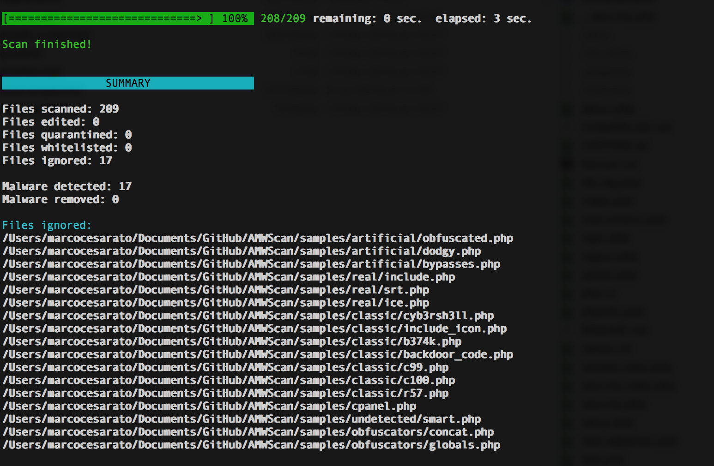

# 

# AMWSCAN - PHP Antimalware Scanner

**Version:** 0.4.0.37 beta

**Github:** https://github.com/marcocesarato/PHP-Antimalware-Scanner

**Author:** Marco Cesarato

This is a php antimalware/antivirus scanner console script written in php for scan your project.
This can work on php projects and a lot of others platform.
Use this command `php -d disable_functions` for run the program without issues

## Requirements

- php 5+

## Wordpress and others

This can work on WordPress and others platform but need the following suggestion.

__Suggestion:__ if you run the scanner on a Wordpress project type _--agile_ as argument for a check with less false positive.

## Install

1. Copy the “HTTPS clone URL” link using the clipboard icon at the bottom right of the page’s side-bar, pictured below.
2. GitHub clone clipboard.
3. In the Linode terminal from the home directory, use the command git clone, then paste the link from your clipboard, or copy the command and link from below:
   `git clone https://github.com/marcocesarato/PHP-Antimalware-Scanner`
4. Change directories to the new ~/PHP-Antimalware-Scanner directory:
   `cd ~/PHP-Antimalware-Scanner/`
5. To ensure that your master branch is up-to-date, use the pull command:
   `git pull https://github.com/marcocesarato/PHP-Antimalware-Scanner`
6. Run `scanner` file that you can find inside `/dist/` folder

## Usage

```		
Arguments:
<path>                       Define the path to scan (default: current directory)

Flags:
-a   --agile                 Help to have less false positive on WordPress and others platforms
                             enabling exploits mode and removing some common exploit pattern
                             but this method could not find some malware
-e   --only-exploits         Check only exploits and not the functions
                             -- Recommended for WordPress or others platforms
-f   --only-functions        Check only functions and not the exploits
-h   --help                  Show the available flags and arguments
-l   --log                   Write a log file 'scanner.log' with all the operations done
-s   --scan                  Scan only mode without check and remove malware. It also write
                             all malware paths found to 'scanner_infected.log' file
                             
     --exploits="..."        Filter exploits
     --functions="..."       Define functions to search
     --whitelist-only-path   Check on whitelist only file path and not line number
     
Notes: For open files with nano or vim run the scripts with "-d disable_functions=''"
       examples: php -d disable_functions='' scanner ./mywebsite/http/ --log --agile --only-exploits
                 php -d disable_functions='' scanner --agile --only-exploits
                 php -d disable_functions='' scanner --exploits="double_var2" --functions="eval, str_replace"
```

## Screenshots


