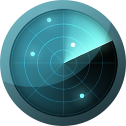

<div align="center">



<h1 align="center">PHP Antimalware Scanner</h1>


[](https://github.com/marcocesarato/PHP-Antimalware-Scanner)

#### If this project helped you out, please support us with a star :star:

[Documentation](https://marcocesarato.github.io/PHP-Antimalware-Scanner/)

</div>

## Description

PHP Antimalware Scanner is a free tool to scan PHP files and analyze your project to find any malicious code inside it.

It provides an interactive text terminal console interface to scan a file, or all files in a given directory (file paths
can be also be managed using `--filter-paths` or `--ignore-paths`), and find PHP code files that seem to contain malicious
code. When a probable malware is detected, will be asked what action to take (like add to whitelist, delete files, try
clean infected code etc...).

The package can also scan the PHP files in a report mode (`--report|-r`), so without interact and outputting anything to
the terminal console. In that case the results will be stored in a report file in html (default) or text
format (`--report-format <format>`).

This scanner can work on your own php projects and on a lot of others platform using the right combinations of
configurations (ex. using `--lite|-l` flag can help to find less false positivity).

:warning: *Remember that you will be solely responsible for any damage to your computer system or loss of data that
results from such activities. You are solely responsible to adequate protection and backup of the data before execute
the scanner.*

### How to contribute

Have an idea? Found a bug? Please raise to [ISSUES](https://github.com/marcocesarato/PHP-Antimalware-Scanner/issues)
or [PULL REQUEST](https://github.com/marcocesarato/PHP-Antimalware-Scanner/pulls). Contributions are welcome and are
greatly appreciated! Every little bit helps.

## :blue_book: Requirements

- php 5.5+
   - php-xml
   - php-zip
   - php-mbstring
   - php-json
   - php-common 
   - php-curl
   - php-gd

## :book: Install

### Release

You can use one of this method to install the scanner downloading it from github or directly from console.

#### Download

Go on GitHub page and press on Releases tab or download the raw file from:

[](https://raw.githubusercontent.com/marcocesarato/PHP-Antimalware-Scanner/master/dist/scanner)

#### Console

1. Run this command from console (scanner will be download on your current directory):

   `wget https://raw.githubusercontent.com/marcocesarato/PHP-Antimalware-Scanner/master/dist/scanner --no-check-certificate`

2. Run the scanner:

   `php scanner ./dir-to-scan -l ...`

3. *(Optional)* Install as bin command (Unix Bash)

   Run this command:

    ```sh
    wget https://raw.githubusercontent.com/marcocesarato/PHP-Antimalware-Scanner/master/dist/scanner --no-check-certificate -O /usr/bin/awscan.phar && \
    printf "#!/bin/bash\nphp /usr/bin/awscan.phar \$@" > /usr/bin/awscan && \
    chmod u+x,g+x /usr/bin/awscan.phar && \
    chmod u+x,g+x /usr/bin/awscan && \
    export PATH=$PATH":/usr/bin"
    ```

   Now you can run the scanner simply with this command: `awscan ./dir-to-scan -l...`

### Source

##### Download

Click on GitHub page "Clone or download" or download from:

[](https://codeload.github.com/marcocesarato/PHP-Antimalware-Scanner/zip/master)

##### Git

1. Install git
2. Copy the command and link from below in your terminal:
   `git clone https://github.com/marcocesarato/PHP-Antimalware-Scanner`
3. Change directories to the new `~/PHP-Antimalware-Scanner` directory:
   `cd ~/PHP-Antimalware-Scanner/`
4. To ensure that your master branch is up-to-date, use the pull command:
   `git pull https://github.com/marcocesarato/PHP-Antimalware-Scanner`
5. Enjoy

## :whale: Docker

1. Download the source
2. Build command
   `docker build --tag amwscan-docker .`
3. Run command
   `docker run -it --rm amwscan-docker bash`

## :mag_right: Scanning mode

The first think you need to decide is the strength, you need to calibrate your scan to find less false positive as possible during scanning without miss for real malware.
For this you can choose the aggression level.

The scanner permit to have some predefined modes:

| Mode                       | Alias | 🚀            | Description                                                                                                                                                                       |
| --------------------------- | ----- | -------- | --------------------------------------------------------------------------------------------------------------------------------------------------------------------------------- |
| None&nbsp;*(default)*            |   | 🔴        | Search for all functions, exploits and malware signs without any restrictions                                                                                                     |
| Only&nbsp;exploits   | `-e` | 🟠     | Search only for exploits definitions<br />Use flag: `--only-exploits`                                                                                                                                            |
| Lite&nbsp;mode          | `-l` | 🟡     | Search for exploits with some restrictions and malware signs *(on Wordpress and others platform could detect less false positivity)*<br />Use flag: `--lite`                                              |
| Only&nbsp;functions  | `-f`| 🟡     | Search only for functions *(on some obfuscated code functions couldn't be detected)* <br />Use flag: `--only-functions`                                                                                             |
| Only&nbsp;signatures | `-s` | 🟢      | Search only for malware signatures *(could be a good solution for Wordpress and others platform to detect less false positivity)*<br />Use flag: `--only-signatures`                                                 |

## :computer: Usage

### Command line

```
php amwscan ./mywebsite/http/ -l -s --only-exploits
php amwscan -s --max-filesize="5MB"
php amwscan -s -logs="/user/marco/scanner.log"
php amwscan --lite --only-exploits
php amwscan --exploits="double_var2" --functions="eval, str_replace"
php amwscan --ignore-paths="/my/path/*.log,/my/path/*/cache/*"
```

To check all options check the [Documentation](https://marcocesarato.github.io/PHP-Antimalware-Scanner/options)

### Suggestions

If you are running the scanner on a Wordpress project or other popular platform use `--only-signatures` or `--lite` flag
to have check with less false positive but this could miss some dangerous exploits like `nano`.

### Programmatically

On programmatically silent mode and auto skip are automatically enabled.

```php
use AMWScan\Scanner;

$app = new Scanner();
$report = $app->setPathScan("my/path/to/scan")
              ->enableBackups()
              ->setPathBackups("/my/path/backups")
              ->enableLiteMode()
              ->setAutoClean()
              ->run();
```

##### Report Object

```php
object(stdClass) (7) {
  ["scanned"]    => int(0)
  ["detected"]   => int(0)
  ["removed"]    => array(0) {}
  ["ignored"]    => array(0) {}
  ["edited"]     => array(0) {}
  ["quarantine"] => array(0) {}
  ["whitelist"]  => array(0) {}
}
```

## :art: Screenshots

### Report

> HTML report format (`default`)


### Interactive CLI

