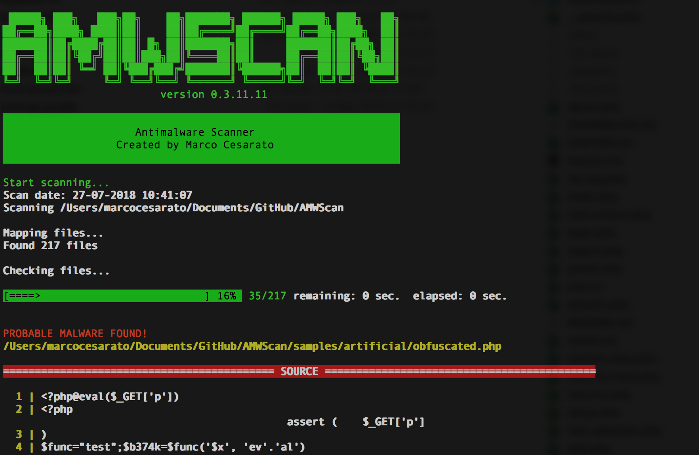
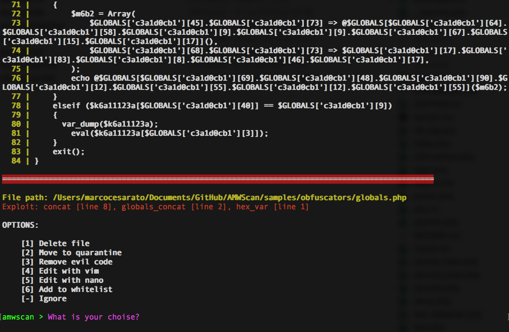

# 

# AMWSCAN - PHP Antimalware Scanner

**Version:** 0.4.0.43 beta

**Github:** https://github.com/marcocesarato/PHP-Antimalware-Scanner

**Author:** Marco Cesarato

## PHP Malware Scanner Free Tool

This package, written in php, can scan PHP files and analyze your project for find malicious code inside it.
It provides a text terminal console interface to scan files in a given directory and find PHP code files the seem to contain malicious code.
The package can also scan the PHP files without outputting anything to the terminal console. In that case the results are stored in a log file.
This scanner can work on your own php projects and on a lot of others platform.
Use this command `php -d disable_functions` for run the program without issues

## Requirements

- php 5+

## Install
 
### Release

Go on GitHub page and press on Releses tab or download the raw file from:
https://raw.githubusercontent.com/marcocesarato/PHP-Antimalware-Scanner/master/dist/scanner

### Source

##### Download

Click on GitHub page "Clone or download" or download from: 
https://codeload.github.com/marcocesarato/PHP-Antimalware-Scanner/zip/master

##### Composer
1. Install composer
2. Type `composer require marcocesarato/amwscan`
3. Go on `vendor/marcocesarato/amwscan/` for have source
4. Enjoy

##### Git
1. Install git
2. Copy the command and link from below in your terminal:
   `git clone https://github.com/marcocesarato/PHP-Antimalware-Scanner`
3. Change directories to the new `~/PHP-Antimalware-Scanner` directory:
   `cd ~/PHP-Antimalware-Scanner/`
4. To ensure that your master branch is up-to-date, use the pull command:
   `git pull https://github.com/marcocesarato/PHP-Antimalware-Scanner`
5. Enjoy

## Distribute

For compile `/src/` folder to single file `/dist/scanner` you need to do this:

1. Install composer requirements:
   `composer install`
2. Run distribute script *(replace 0.4.x.x with your version number)*:
   `php distribute.php 0.4.x.x`

## Test

For test detection of malwares you can try detect they from this collection:

https://github.com/marcocesarato/PHP-Malware-Collection

## Suggestion

If you run the scanner on a Wordpress project type *--agile* as argument for a check with less false positive.

## Usage

```		
Arguments:
<path>                       Define the path to scan (default: current directory)

Flags:
-a   --agile                 Help to have less false positive on WordPress and others platforms
                             enabling exploits mode and removing some common exploit pattern
                             but this method could not find some malware
-e   --only-exploits         Check only exploits and not the functions
                             -- Recommended for WordPress or others platforms
-f   --only-functions        Check only functions and not the exploits
-h   --help                  Show the available flags and arguments
-l   --log                   Write a log file 'scanner.log' with all the operations done
-s   --scan                  Scan only mode without check and remove malware. It also write
                             all malware paths found to 'scanner_infected.log' file
                             
     --exploits="..."        Filter exploits
     --functions="..."       Define functions to search
     --whitelist-only-path   Check on whitelist only file path and not line number
     
Notes: For open files with nano or vim run the scripts with "-d disable_functions=''"
       examples: php -d disable_functions='' scanner ./mywebsite/http/ --log --agile --only-exploits
                 php -d disable_functions='' scanner --agile --only-exploits
                 php -d disable_functions='' scanner --exploits="double_var2" --functions="eval, str_replace"
```

## Screenshots


